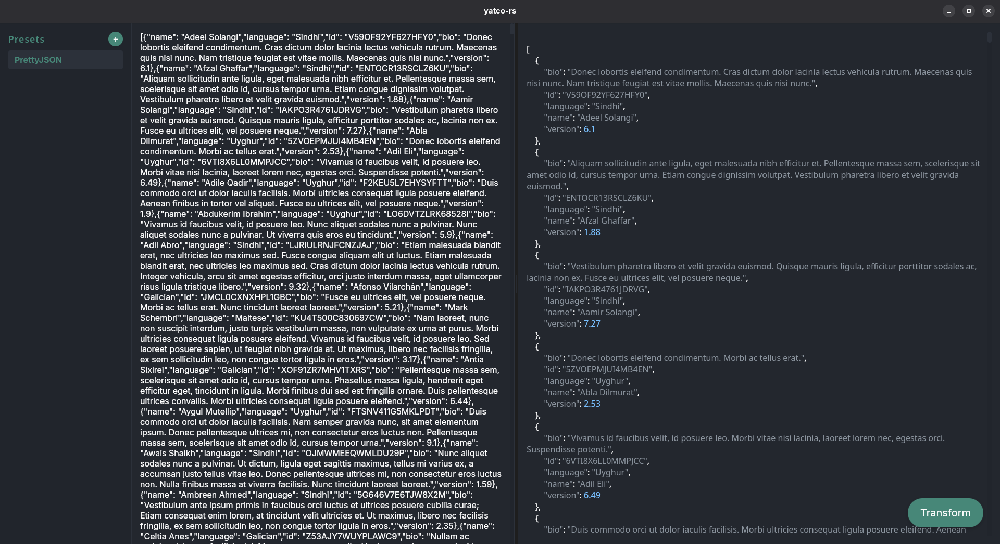

yatco-rs
=======



yatco-rs ("Yet Another Text Converter") is a small cross-platform desktop GUI application built with Svelte (Vite) and Tauri (Rust). It provides a compact interface for applying text transformations and previews using native desktop packaging.

## Quick summary

- Frontend: Svelte + Vite
- Backend / Desktop: Tauri (Rust)

## Prerequisites

- Node.js (18+ recommended) and npm
- Rust toolchain (rustup + cargo)
- Tauri CLI (optional, can be invoked via npm script)
- On Linux, you may need system packages for building native apps (for example: build-essential, libssl-dev, libgtk-3-dev, libwebkit2gtk-4.0-dev). See the Tauri docs for the exact list for your distribution.

## Development

1. Install JavaScript and Rust dependencies:

```
# install frontend deps using the project's Makefile
make deps

# ensure Rust toolchain is installed
rustup toolchain install stable
```

2. Run the application in development mode (Tauri + frontend hot reload):

```
make dev
```

## Build and package

Build and package the application using the Makefile target:

```
make build
```

This runs the Tauri build which will produce platform installers/bundles under `src-tauri/target/release/bundle` (or a similar output path depending on platform).